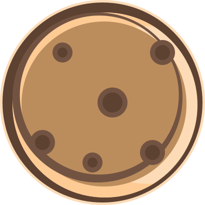

 
 <h2 align="center">Haoning Wu</h2>

  
  
  
  
  
  

  <a href="https://www.nousbuild.org/">My Website</a> | <a href="https://bitcookies.nousbuild.com/">Bit Cookies</a>

Hello! I'm **Haoning**, a computer science postgraduate and architectural designer from China who has a passion for learning new stuffs and sharing knowledge with others. My published application can be seen on this github account [@bitcookies](https://github.com/bitcookies/).

When I'm not in front of a screen, I'm probably drawing manga, writing blogs, reading books or watching animations.

  

#### ⚡️ A Few Quick Facts

- 🎓 Graduate student, majoring in _Computer Science_ and _Civil Engineer_.
- 🏷 Personal Webmaster ([nousbuild.org](https://www.nousbuild.org/)).
- ✏️ Original Comic Author ([CatTalk](https://cattalk.nousbuild.org/)).
- ⚡ Writing code with _C++_ / _Swift_ / _JavaScript_ / _Python_ / _Matlab_.
- 📫 Contact me via [leave a message](https://www.nousbuild.org/me/connect/).

#### 📋 Recent Dev Projects

| Project Name  | Category  |
| :----------------------------------------------------------- | ------------ |
| [Pudding VSCode Theme](https://github.com/bitcookies/pudding-vscode-theme) | VSCode Theme |
| [WinRAR Keygen](https://github.com/bitcookies/winrar-keygen) | C++          |
| [CatTalk](https://github.nousbuild.com/get-cityweather/)     | Mini Program |
| [City Weather](https://github.nousbuild.com/get-cityweather/) | Mini Program |
| [Pitch Perfect](https://github.com/windmill0503/pitchPerfect) | Swift        |
